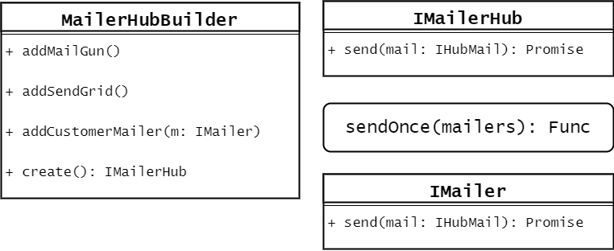

# MailerHub
This package integrates multiple email service providers e.g. MailGun, SendGrid, when you use this package to send an email, it will try to send an email with each of its integrated services until success. That means, as long as you have at least one email service provider up and running, the email will be sent successfully.

As this package is still at its unstable version, you are not encourage to use at the moment.

Currently MailGun and SendGrid are supported, more email services might be added in later.

## Getting Started

 - install the package
  ```sh
    npm install --save @victordotdevelop/mailer-hub
  ```
 - set up mailer hub with your own api keys (you can sign up at MailGun and SendGrid's site)
 - then try to send an email
  ```javascript
      const mailerHubLib = require('vicdotdev-mailer-hub');
      const makeMailerHubBuilder = mailerHubLib.makeMailerHubBuilder;
      const ErrorTypes = mailerHubLib.ErrorTypes;

      // set up mailers, i.e. email service provider
      const builder = makeMailerHubBuilder();
      const mailHub = builder
      .addMailGun({
          apiKey: 'key-xxxxxxxxxxxxxxxxxxxxxxxxxxx',
          domain: 'sandboxxxxxxxxxxxxxxxxxxxxxxxxx.mailgun.org',
          senderAcc: 'postmaster',
      })
      .addSendGrid({
          apiKey: 'XXXXXXXXXXXXXXXXXXXXXXXXXXXXXXXXXXXXXXXXXXX',
          domain: 'sendgrid.sandbox',
          senderAcc: 'postmaster',
      })
      .create();

      // send an email
      mailHub.send({
          to: 'someone@example.org',
          cc: 'someonecc@example.org',
          bcc: 'someonebcc@example.org',
          subject: 'Sample code: how to send email with this package',
          text: `And more information in paragrahs`,
      })
      .then(() => {
        console.log('email was sent sucessfully');
      })
      .catch((err) => {
        if (err instanceof ErrorTypes.IncompleteMailError) {
          // this means you did not provide enough fields: to, subject, text
        }
        if (err instanceof ErrorTypes.AllMailerFailError) {
          // this means all of your email services provider failed to send this email
        }
      })
  ```
Note that you can also pass an array of email addresses for `to`, `cc`, `bcc`

## TypeScript support
This project was written in typescript. You can look for function signatures from the .d.ts.

## Development

If you want to further develop this package by your own:

```sh
  git clone <this repo github clone address>
  cd <this repo>
  npm intall
```

### Run the tests
Note that you have to to rename `./src/tests/data/secret/xxxxx.secret.exmaple.ts` back to `./src/tests/data/secret/xxxxx.secret.ts`. Then fill in your own api keys and domain settings in the files. Then you can run

```sh
  npm test
```

__Caution__: If you are using MailGun's sandbox domain, running these tests will use up your sandbox message limit pretty quickly, by that time your tests against MailGun service will __fail__, and you will see console error messages  __Error: message limit reached__

### Build 
```sh
  npm run build
```
### Directory Structure

Below shows a glance of the source code folder

```sh
  src                                       
  ├── errors.ts                               # publicly exposed error types
  ├── index.ts                                # lib entrance
  ├── interfaces.ts                           # interfaces (data model)
  ├── mailer-hub.ts                           # main component, the abstraction layer of multiple email services
  ├── mailers                                 # specific email service providers
  │   ├── mailgun.ts
  │   └── sendgrid.ts
  └── tests                                   # test files and data
      ├── data
      │   ├── emails.ts
      │   └── secret
      │       ├── mailgun.secret.exmaple.ts
      │       ├── mailgun.secret.ts           # this is not committed to git repo. you have to fill in your own.
      │       ├── sendgrid.secret.example.ts
      │       └── sendgrid.secret.ts          # this is not committed to git repo. you have to fill in your own.
      ├── index.spec.ts
      ├── mailer-hub.spec.ts
      ├── mailers
      │   ├── mailgun.spec.ts
      │   └── sendgrid.spec.ts
      └── send-mail.spec.ts
```

### Major Components

Below shows the major components in this package.



 - __IMailerHub__: This is the object to be used by other parties to send an email
 - __MailerHubBuilder__: Users are supposed to input their configuration of different email service provider(i.e. ___mailer__) and build a __IMailerHub__ object
 - __IMailer__: one __IMailer__ represents exatly one specific email service provider.
 - __sendOnce__: a core function responsible for sending ONE successful email among many email servicer providers(they are called __mailers__ in code). This function plays the logic of __fail over__.

## TODOs
 - Validate credentials of different email service providers
 - Logging and detailed error messages

## Acknowledgements

https://www.twilio.com/blog/2017/06/writing-a-node-module-in-typescript.html
